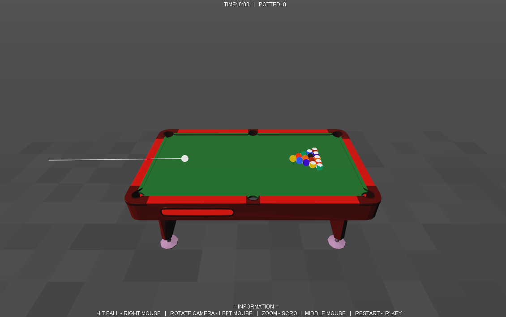
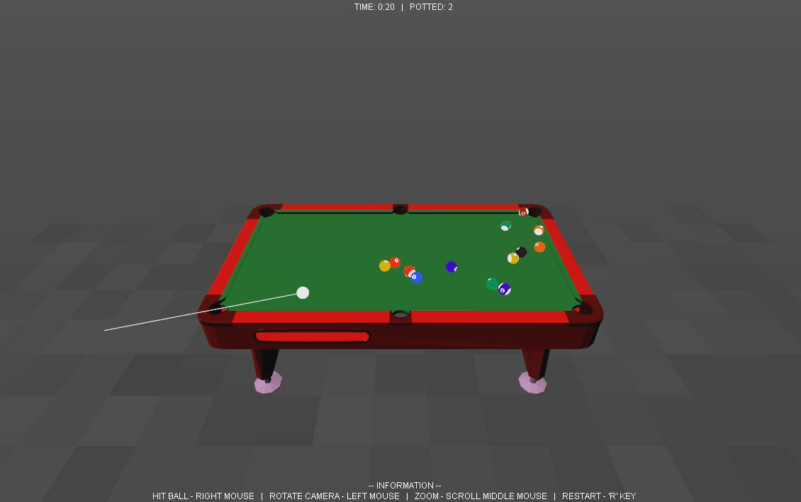

## Java3D-Pool
3D Pool game developed using the Java3D API (1.5.2), as part of my Advanced Programming module at university.

Watch the [demonstration video on YouTube](https://youtu.be/Mr8AfRH1dgQ).

